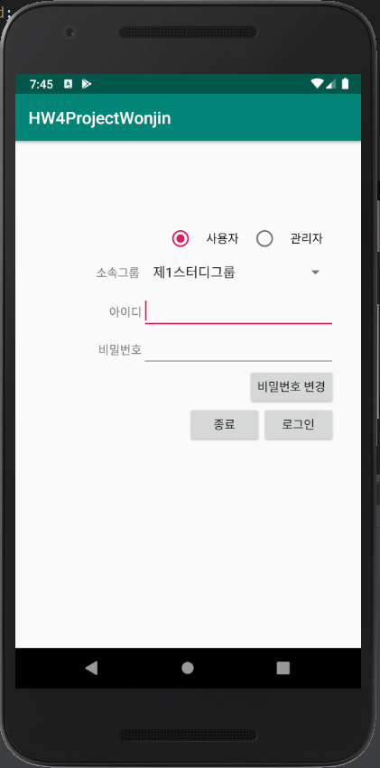
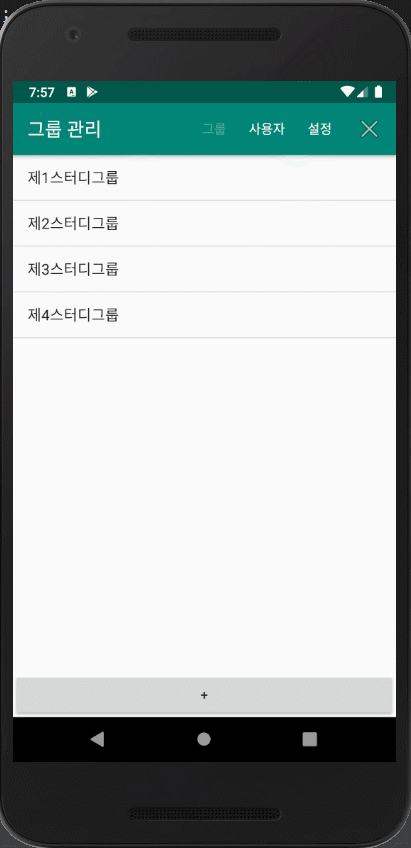
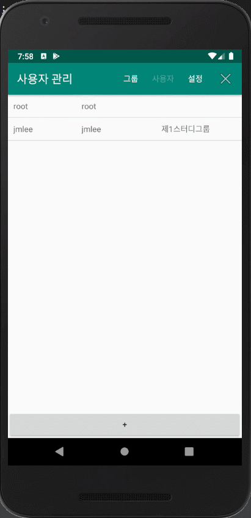
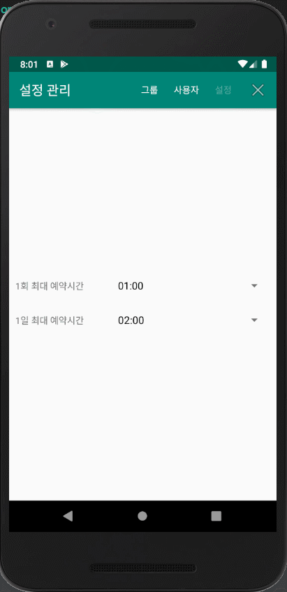
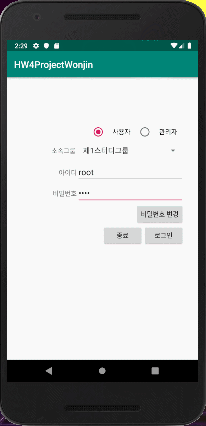

# Booking-System
한성대학교 이재문 교수님의 안드로이드 프로그래밍 수업을 듣고 제출한 최종 프로젝트 입니다. 

- 최초 로그인 화면에서 사용자 모드와 관리자 모드를 선택할 수 있습니다.

- 관리자 모드
  - id: root, pw: root
  - 그룹 관리 
    - 하단의 + 버튼 클릭: 소속 그룹을 추가합니다.
    - 해당 그룹명 길게 클릭: 소속 그룹을 삭제합니다. 삭제 시 그룹에 소속된 사용자 정보도 사라집니다.
  
    
    
  - 사용자 관리
    - 하단의 + 버튼 클릭: 사용자 정보(id, pw)를 추가합니다. 이때 사용자는 소속 그룹을 선택할 수 있습니다.
    - 해당 사용자명 길게 클릭: 사용자 정보를 삭제합니다.
    
    
     
  - 설정 관리
    - 30분 간격으로 1회 최대 예약시간(연속 가능 시간), 1일 최대 예약 시간을 설정할 수 있습니다.
    
     
     
- 사용자 모드
  - 디바이스 시간에 맞추어서 타임 테이블이 실시간으로 변동됩니다.
  - 원하는 시간대를 클릭하여 예약할 수 있습니다.
  - 이미 지난 시간에 대해서는 예약이 불가능합니다.
  - id: jmlee, pw: jmlee
  - 오직 root 사용자만 다른 사용자의 예약을 취소할 수 있습니다.
  
   
   
   
     
